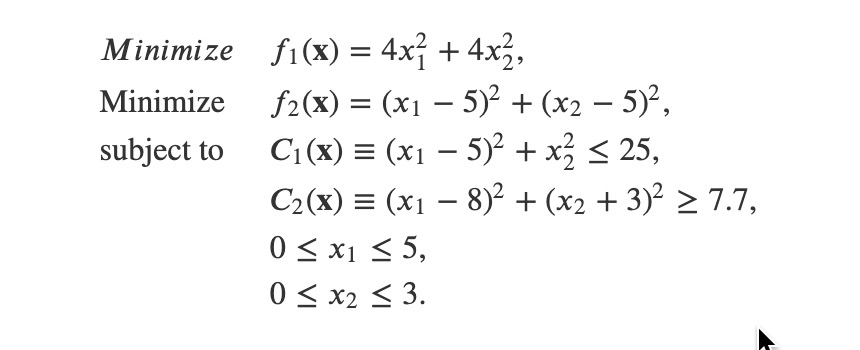
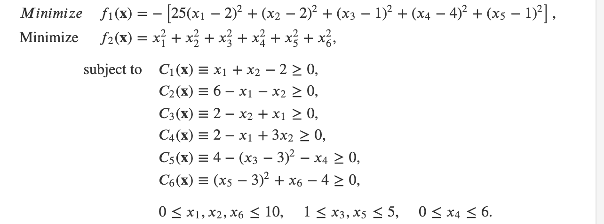
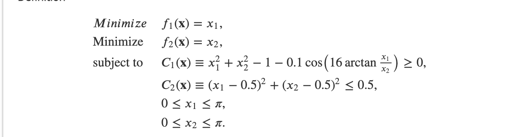
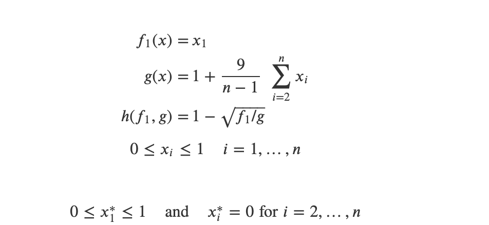
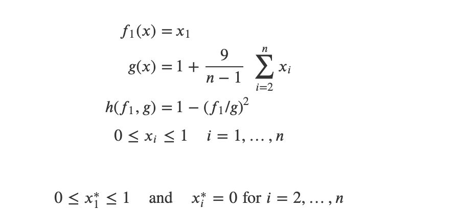
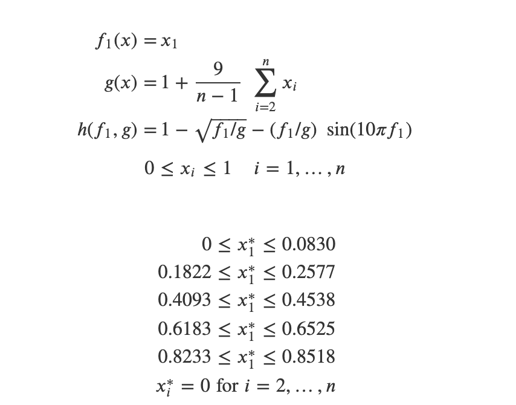
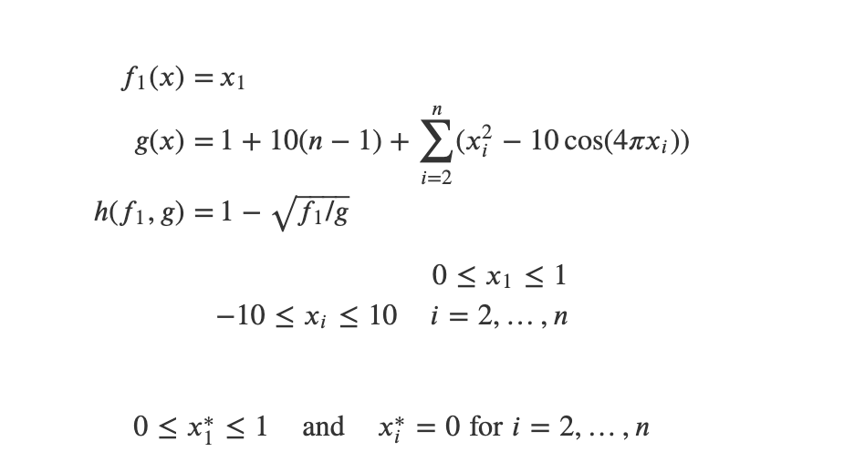
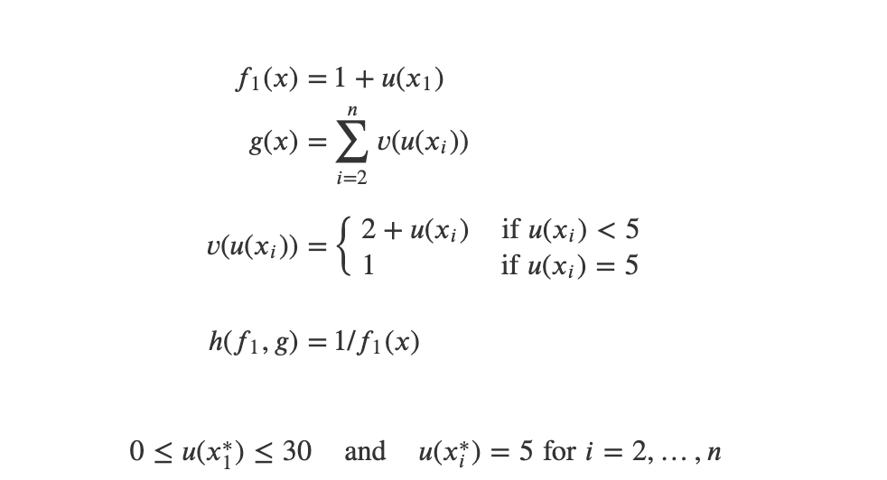
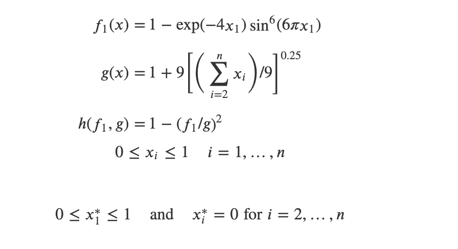

# [Coded Problems](https://en.wikipedia.org/wiki/Test_functions_for_optimization)
  


<!-- $
\text{s.t.=}
\begin{cases}
g_{1}\left(x,y,z\right)={x-3+y^2+z}\leq0\\
g_{2}\left(x,y,z\right)={y^2+z-x^4}\leq5\\
g_{3}\left(x,y,z\right)={z^3+\frac{y^2}{2}}\leq0\\
\end{cases}
$ --> 


| Probelm | Function | Constarints | 
| --- | --- | ---| 
|p1|   |   | 
|p2 |  ||
|p3|||
|p4|||
|p5|||
|p6|||


---
# Problem from Pacages 
| Probelm | Function  | Variables | Objectives | Description|
| --- | --- | ---|---|--- |
|   BNH   | |   2  |  2  | 2 | 
|   OSY   |   |   6  | 2   |6 |
|   TNK    |  |  2   | 2   |2 |
|   ZDT1   |  | 30    |  2  | |
|   ZDT2   |  | 30    |  2 | |
|   ZDT3   |  | 30    |  2| |
|   ZDT4   |  | 10    |  2  | |
|   ZDT5   |  | 80    |  2  | |
|   ZDT6   |  | 10    |  2  | |


----


<!-- $
\text{s.t.=}
\begin{cases}
g_{1}\left(x,y,z\right)={x^2+y^2-255}\leq0\\
g_{2}\left(x,y,z\right)={x-3y+10}\leq0\\
\end{cases}
$ -->


<!-- $
\text{s.t.=}
\begin{cases}
g_{1}\left(x,y\right)={x^2+y^2-225} \le0\\
g_{2}\left(x,y\right) = x-3y+10\le0\\
-20\le x \le20\\
-20\le y \le20
\end{cases}

$ --> 

## Testing problem


```bash

$ python NSGA-II.py -p p4 -lb 1 2 -ub  6 6 -s 600 -f NSGA-II_p3_lb_1_2_ub_6_6_s_400 -eval 800


output>>>
***********
probelm is :
# name: p4
# n_var: 2
# n_obj: 2
# n_constr: 2


********************
According input, design variable bound is as below
[[1. 6.]
 [2. 6.]]


from bound give above, generating  data points (600, 2) successfully

********************

------problem evaluation-----
600 is feasible and 0 is infeasible among 600 data points


---------
feasible_X path is:  /Users/wuyoscar/Desktop/MOOP/Result/NSGA-II_p3_lb_1_2_ub_6_6_s_400feasible_X.txt
------------
infeasible_X path is:  /Users/wuyoscar/Desktop/MOOP/Result/NSGA-II_p3_lb_1_2_ub_6_6_s_400infeasible_X.txt
------------
feasible_F path is:  /Users/wuyoscar/Desktop/MOOP/Result/NSGA-II_p3_lb_1_2_ub_6_6_s_400feasible_F.txt
------------
infeasible_F path is:  /Users/wuyoscar/Desktop/MOOP/Result/NSGA-II_p3_lb_1_2_ub_6_6_s_400infeasible_F.txt
=====================================================================================
n_gen |  n_eval |   cv (min)   |   cv (avg)   |  n_nds  |     eps      |  indicator  
=====================================================================================
    1 |     100 |  0.00000E+00 |  0.00000E+00 |      10 |            - |            -
    2 |     200 |  0.00000E+00 |  0.00000E+00 |      14 |  0.062171519 |        ideal
    3 |     300 |  0.00000E+00 |  0.00000E+00 |      21 |  0.069999124 |        ideal
    4 |     400 |  0.00000E+00 |  0.00000E+00 |      33 |  0.014889819 |            f
    5 |     500 |  0.00000E+00 |  0.00000E+00 |      44 |  0.169329240 |        nadir
    6 |     600 |  0.00000E+00 |  0.00000E+00 |      59 |  0.009545153 |            f
    7 |     700 |  0.00000E+00 |  0.00000E+00 |      77 |  0.498303345 |        nadir
    8 |     800 |  0.00000E+00 |  0.00000E+00 |      99 |  0.006696543 |        ideal

Time elapsed for solving problem:  0.05109810829162598  seconds
```

