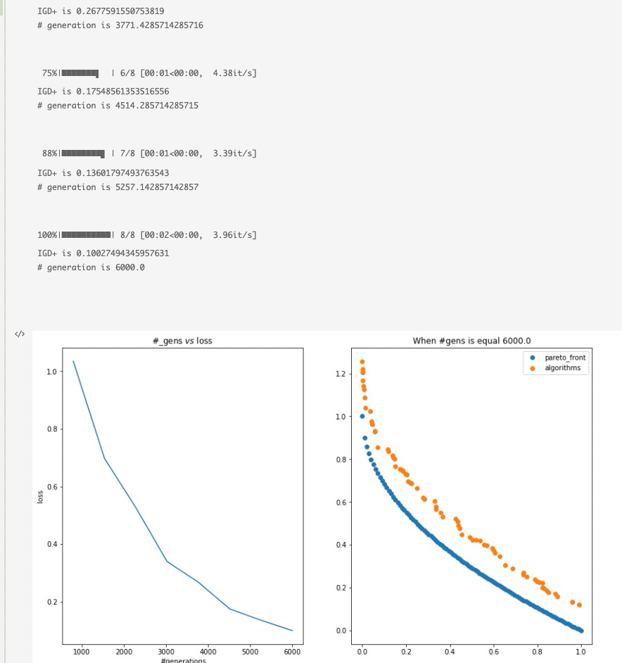

# MOOP


----

## *All the problems loop files has been updated*

----
### [problems](https://en.wikipedia.org/wiki/Test_functions_for_optimization)
  
  
   - Available problems:
      - [binh_and_korn](https://en.wikipedia.org/wiki/File:Binh_and_Korn_function.pdf)
      - [test](https://en.wikipedia.org/wiki/File:Test_function_4_-_Binh.pdf)
      - [constr_ex](https://en.wikipedia.org/wiki/File:Constr-Ex_problem.pdf)
      - [changkong_and_haimes](https://en.wikipedia.org/wiki/File:Chakong_and_Haimes_function.pdf)
  
      - Problem list : **problem_list = ['BNH', 'OSY', 'TNK', 'Truss2D', 'Welded_Beam', 'zdt1','ZDT2','ZDT3','ZDT4','ZDT5','ZDT6']**

----

### Click here to use [Problems files](https://github.com/wuyoscar/MOOP/tree/master/Loop%20files/problems)
   - Can be used for random searching, and will generate result files, including:
      1. search_domain_feasible_X.txt, 
      2. search_domain_infeasible_X.txt, 
      3. search_domain_feasible_F.txt, 
      4. search_domain_infeasible_F.txt

   - **Options**: The number of data points (code line 73)and search domain can be defined by user (code line 69), default: random searching

----
### Algorithmns


```
updating........
```

## [Example.pdf](https://github.com/wuyoscar/MOOP/blob/master/examples.ipynb)


